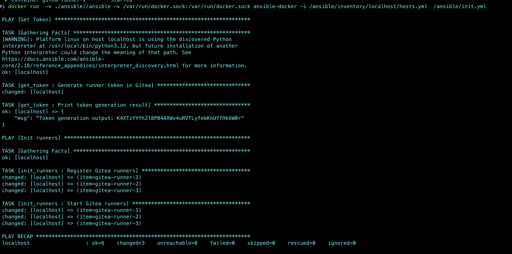
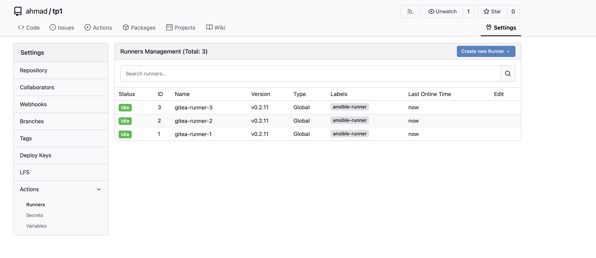

# Ansible-Docker Automation Project

This project demonstrates an automated workflow using Ansible inside a Docker container to manage gitea infrastructure with runners. 

The setup includes running Ansible playbooks in a containerized environment with easy integration with Docker Compose.

Traefik was not used because this project is deployed on production behind an nginx reverse proxy: [https://gitea.devgains.com/](https://gitea.devgains.com)


---

## Prerequisites

Before you begin, ensure the following prerequisites are met:

1. **Docker and Docker Compose Installed**  
   - Install Docker: [Docker Installation Guide](https://docs.docker.com/get-docker/)  
   - Install Docker Compose: [Docker Compose Installation Guide](https://docs.docker.com/compose/install/)

2. **Ansible Knowledge**  
   Familiarity with Ansible, playbooks, and inventory management will help you understand and modify the workflow.

3. **Project Directory Structure**  
   Ensure your project directory follows this structure:
   ```
   .
   ├── ansible/
   │   ├── inventory/
   │   │   ├── localhost/
   │   │   │   ├── hosts.yml
   │   ├── playbooks/
   │   │   ├── init.yml
   │   ├── roles/
   │   │   ├── <role_name>/
   │   │   │   ├── tasks/
   │   │   │   │   ├── main.yml
   ├── Dockerfile
   ├── docker-compose.yml
   └── README.md
   ```

---

## Getting Started

### 1. **Build the Docker Image**

Build the custom Ansible Docker image using the `Dockerfile` provided:
```bash
docker build -t ansible-docker .
```

This will create a Docker image named `ansible-docker` with Ansible and other required tools pre-installed.

---

### 2. **Run the Application with Docker Compose**

Use Docker Compose to start the Ansible container along with any dependent services:
```bash
docker compose up -d --build
```

- **`-d`**: Runs the containers in detached mode (background).
- **`--build`**: Rebuilds the image before starting the containers.

---

### 3. **Access and Configure-Install the Gitea Application**

Access the Gitea application at `http://localhost:3000` and configure the application as needed.

Create a new repository 

---

### 4. **Run the Ansible Playbook**

Execute the Ansible playbook from within the Docker container:
```bash
docker run   -v ./ansible:/ansible   -v /var/run/docker.sock:/var/run/docker.sock   ansible-docker   -i /ansible/inventory/localhost/hosts.yml   /ansible/init.yml
```

#### Explanation:
- **`-v ./ansible:/ansible`**: Mounts the local `ansible` directory into the container to share playbooks, inventory, and configuration files.
- **`-v /var/run/docker.sock:/var/run/docker.sock`**: Provides the container with access to the Docker daemon for managing containers via Ansible modules.
- **`ansible-docker`**: The Docker image built in step 1.
- **`-i /ansible/inventory/localhost/hosts.yml`**: Specifies the inventory file for the playbook.
- **`/ansible/init.yml`**: The playbook to execute.

---




---

### Improvements


---
